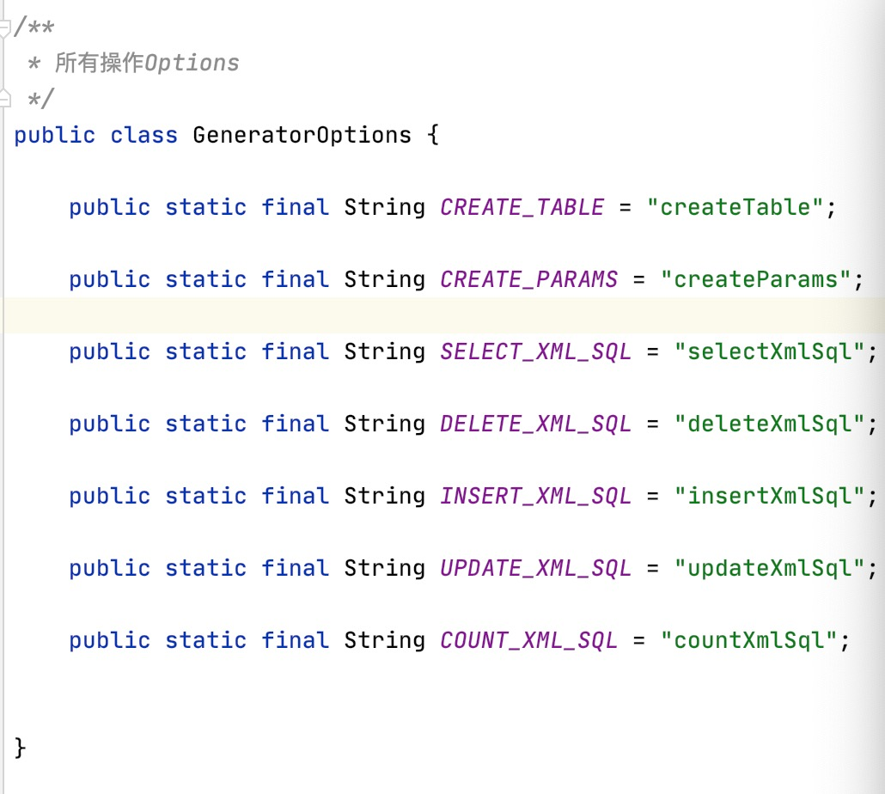

# 一个简单的Mybatis XML Code生成工具

## why do it？

简单一句话：mybatis的基础XML的编写实在是太烦了。

## 如何实现

这里使用了一个工厂模式，通过CodeFactory实现对于不同类型的生成器的控制工作。

SQL的操作主要是有一个SQLTemplate进行模版操作。这个就是我们预设的基础模版，可以通过我们这个模版进行生成所有的代码。

当然为了统一管理，我这里GeneratorOptions特地把所有的（目前所支持的）操作做了个封装，所有的通过这个命令即可。



## how to use it？

### options集合

createTable：创建表，可以直接生成出对应的create的sql语句。

createParams：生成sql集合。

selectXmlSql： 生成select格式的sql。

deleteXmlSql：生成delete格式的sql。

insertXmlSql：生成insert格式的sql。

updateXmlSql：生成update格式的sql。

countXmlSql：生成countsql。

### 使用方式

主代码位于：org.bert.generator.CodeGenerator。

```java
    public static void main(String[] args) throws ClassNotFoundException {
        // 获取到对应的对象
        CodeGenerator codeGenerator = new CodeGenerator();

        Class clazz = Class.forName("类全名");

        // 解析Class
        codeGenerator.getParams(clazz);
        codeGenerator.start(clazz);
    }

    /**
     * 启动工具
     */
    private void start(Class clazz) {
        // 获取类全名和类名
        String simpleName = clazz.getSimpleName();
        String name = clazz.getName();
				// 设定初始参数
        table.setModelClassName(name);
        table.setTableName("数据库表名称");
        table.setXmlName(simpleName);
        table.setMapperType(name + "Mapper");
        // 这里写类全名称
        table.setDaoPath("dao类全名");
        String sql = this.generatorCode(GeneratorOptions.CREATE_ALL_XML_SQL);
        String mapperMethod = this.generatorCode(GeneratorOptions.CREATE_MAPPER_CODE);
        // 导出为XML
        FileOperation.saveDataToFile(simpleName + FileConfig.FileNameType.XML_TYPE, sql, FileConfig.FilePathConfig.XML_PATH);
        // 导出为Mapper.java
        FileOperation.saveDataToFile(simpleName + FileConfig.FileNameType.MAPPER_JAVA_TYPE, mapperMethod, FileConfig.FilePathConfig.MAPPER_JAVA_PATH);
    }
```

getParams：这里传入待生成的java对象，切记不要传入类全名，这里还没做class.forName的反射。

start：传入sql的表名称，基础的实体名称，想要进行的操作（操作的话可以在Options集合中可以查到）。

## to do list

1）getParams支持填写类全名 已支持。

2）支持生成Mapper文件和XML实体文件 已支持。

3）idea插件话，接入idea插件体系，支持UI界面。

## update log

时间：2021/3/7下午4:30:47

- 支持类全名生成
- 支持Mapper和XML生成

## end

欢迎使用～

有兴趣的也可以提MR～